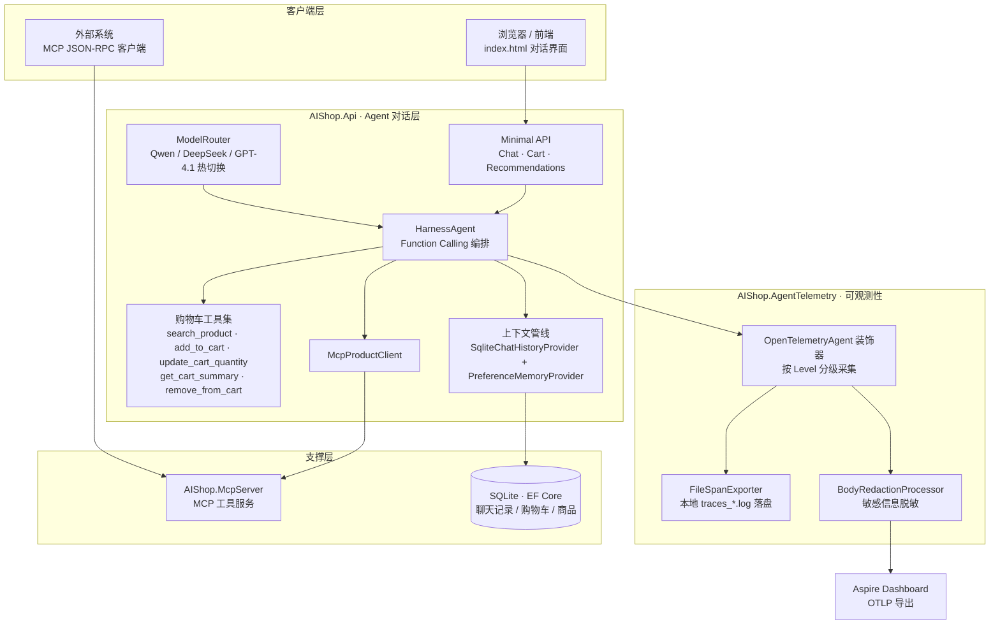
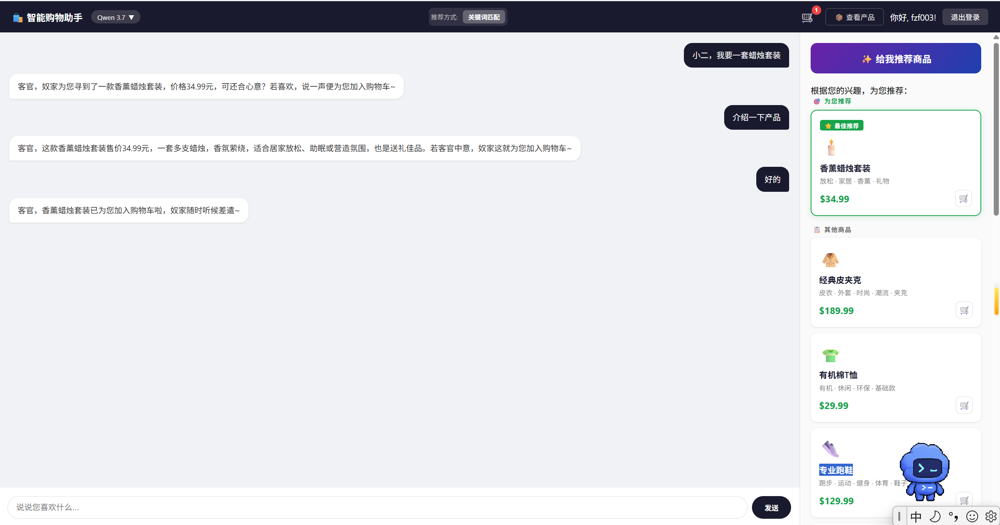

# AIShop — AI 购物产品推荐系统

基于 **.NET 10** 与 **大语言模型** 的对话式购物推荐引擎：用户用自然语言描述需求，Agent 通过 **Function Calling** 完成商品匹配、购物车操作与偏好记忆，并通过 **MCP 协议** 把商品能力开放给任何外部系统。多模型可插拔、全链路可观测。

---

## 🏛️ 架构总览



**依赖单向**：`Core（领域，零依赖）← Infrastructure ← Api / McpServer`，业务按垂直切片（Chat / Cart / MCP）组织，改一个功能不牵连其它功能。

---

## ✨ 核心亮点

| 亮点 | 说明 |
|------|------|
| 🧠 **工具驱动的购物 Agent** | Agent 只做推理与工具编排，商品目录 / 购物车数据全部经 Function Calling 按需拉取，不注入全量上下文 |
| 🔀 **多模型热切换** | ModelRouter 在 Qwen3.8-max / DeepSeek V4 / GPT-4.1 间即时切换，同一套指令与工具全模型兼容 |
| 🔌 **MCP 双通道** | 独立 McpServer 对外暴露商品匹配工具；Api 内部经 Aspire 服务发现消费同一能力，内外复用一套逻辑 |
| 🛒 **对话驱动购物车** | 加购、改量、删项、汇总全程由自然语言驱动，5 个工具覆盖完整购物车生命周期 |
| 🧪 **146 个测试护航** | 集成 + 单元双项目覆盖，SonarAnalyzer 警告即错误，质量门禁自动拦截 |

> Agent 设计与可观测性是本项目两大工程重点，详见下文。

---

## 🤖 Agent 设计

### 1. 统一 Agent 核心 · 多模型可插拔

`ShoppingAssistantAgent` 基于 MAF `HarnessAgent` 构建，**只依赖 `IChatClient` 抽象**，模型差异全部收敛到 `ModelRouter`：按 `appsettings.json` 的 `Models` 节注册多模型、`ActiveModel` 指定当前模型，`ConcurrentDictionary<string, Lazy<Agent>>` 缓存各模型 Agent 实例，**热切换零重建开销**，并兼容旧版 `OpenAI` 配置格式。

### 2. Function Calling 工具驱动（不注入数据）

5 个工具覆盖完整购物链路，Agent 按需调用，上下文保持精简（`system prompt` 只含推理规则，不塞商品全量数据）：

| 工具 | 职责 |
|------|------|
| `search_product(keyword)` | 按关键词匹配商品 |
| `add_to_cart(productId, quantity)` | 追加商品（在原数量上加） |
| `update_cart_quantity(productId, quantity)` | 设置精确数量（"只要 X 个"时调用） |
| `get_cart_summary()` | 查询购物车汇总 |
| `remove_from_cart(itemId)` | 移除商品 |

### 3. 多模型兼容的响应约束（关键工程决策）

为让 Qwen / DeepSeek / GPT-4.1 输出同一格式，采用**统一 Text + Instructions 内嵌 JSON 示例**约束输出——刻意**不用** Schema 定义（实测 Qwen 会把 Schema 复制进输出导致解析失败）。OpenAI 模型额外叠加 `ForJsonSchema` 格式兜底，非 OpenAI 模型走服务端 `IndexOf('{')` 抠取 JSON 反序列化，辅以"工具调用后必回话"等护栏规则。该路径经验证为 4 类模型（OpenAI / DeepSeek / Qwen / MiMo）100% 兼容的唯一路径。

### 4. 模型适配中间件管道

模型协议差异用 `IChatClient` 中间件管道化修复，**不改 Agent 核心**：

```
IChatClient ──► SanitizingChatClient        # 输出脱敏
             ──► QwenToolCallFixClient      # 修复 Qwen 工具调用格式
             ──► DeepSeekDelegatingChatClient # 统一重试 / 错误处理
             ──► DeepSeekChatClient         # 协议适配
```

### 5. 上下文与记忆

- **`SqliteChatHistoryProvider`**：EF Core 持久化聊天历史。增量追加 + 后台裁剪（每 session 保留最新 50 条），行列化存储解包 MEAI `ChatMessage.Contents`，`reasoning` 独立列；多 FunctionResultContent 以 JSON 数组单行存储、读回逐条重建，压缩时保证 assistant↔tool 配对不被拆散（D33 有专项回归测试护航）。
- **`PreferenceMemoryProvider`**：作为 `AIContextProvider` 注入用户偏好记忆。
- 限制 `MaximumIterationsPerRequest = 3`，防止工具循环失控。

---

## 📡 Agent 可观测性

独立 `AIShop.AgentTelemetry` 库，复刻微软官方 `AgentTelemetry` 模式，**不引入额外依赖、不埋自定义埋点**，全部数据来自 MAF 内建 `OpenTelemetryAgent`。

### 1. 双通道追踪

| 通道 | 去向 | 内容 |
|------|------|------|
| **OTLP** | Aspire Dashboard | 标准分布式追踪（span 结构、耗时、状态、工具调用链） |
| **本地落盘** | `traces_*.log` | Debug 模式下的 HTTP 请求/响应 headers + body 详情 |

### 2. 分级采集（配置即切换）

`AgentTelemetryOptions.Level` 三档，`appsettings.json` 改配置即可，**无需重编译**：

| Level | 采集内容 | 适用 |
|-------|---------|------|
| `None` | 不包装装饰器 | 极致性能 |
| `Metadata`（默认） | 元数据：耗时 / 状态 / 工具调用结构 | 生产 |
| `MetadataAndContent` | 消息内容 / 工具参数 / 工具结果 | 排障 |

### 3. 保序处理器链（安全核心）

Debug 模式下三级处理器**严格保序**，保证敏感信息只在本地、不进 OTLP：

```
EnrichWith 抓取 body（HTTP 请求/响应 span）
      │
      ▼
FileSpanExporter ──► 真实 body 写入本地 traces_*.log
      │
      ▼
BodyRedactionProcessor ──► 6 个敏感 tag 覆盖为 [redacted]
      │
      ▼
OTLP 导出 ──► Aspire Dashboard（只见占位符，不见明文）
```

> 设计约束：.NET `Activity` 不支持移除 tag，只能覆盖，故用 `SetTag(tag, "[redacted]")`；`BodyRedactionProcessor` 必须注册在 FileSpanExporter 之后、OTLP exporter 之前。

### 4. 零配置开销

`Debug=false`（默认）时，三个扩展方法全部短路返回——不设置 EnrichWith 回调、不注册处理器，运行时**零额外开销**。

---

## ⚙️ 技术栈

| 类别 | 技术 |
|------|------|
| 运行时 | .NET 10 / C# 14 |
| Agent | Microsoft Agent Framework 1.10（HarnessAgent） |
| LLM | 多模型路由：Qwen3.8-max / DeepSeek V4 / GPT-4.1 |
| 数据库 | SQLite（EF Core） |
| 可观测性 | OpenTelemetry + Serilog |
| MCP | ModelContextProtocol 1.0 |
| 编排 | .NET Aspire（服务发现 / 健康检查 / OTLP） |
| 测试 | xUnit + NSubstitute（146 个） |
| 质量门禁 | SonarAnalyzer（警告即错误） |

---

## 🖥️ 效果预览



对话驱动的完整购物链路：自然语言选品 → 加购 → 改量 → 合计结算。

---

## 📚 文档

- [架构说明](docs/ARCHITECTURE.md)
- [安装指南](docs/INSTALL.md)
- [MCP 接入说明](docs/superpowers/mcp-integration-guide.md)
- [设计文档](docs/design/)
