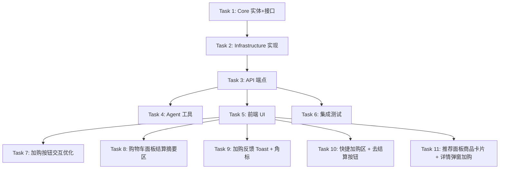

# 购物车功能 — 任务工单

## 任务列表

| ID | 工单 | 涉及文件 | 依赖 | 状态 |
|----|------|----------|------|------|
| 1 | Core 实体和仓储接口 | `AIShop.Core/Entities/CartEntities.cs`, `AIShop.Core/Interfaces/ICartRepository.cs` | 无 | [x] |
| 2 | Infrastructure 实现 | `AIShop.Infrastructure/Data/AppDbContext.cs`, `AIShop.Infrastructure/Repositories/CartRepository.cs`, `AIShop.Infrastructure/DependencyInjection.cs` | Task 1 | [x] |
| 3 | API 端点 | `AIShop.Api/Features/Cart/CartEndpoints.cs`, `AIShop.Api/Program.cs` | Task 2 | [x] |
| 4 | Agent 购物车工具 | `AIShop.Api/Agents/CartToolProvider.cs`, `AIShop.Api/Agents/ShoppingAssistantAgent.cs` | Task 3 | [x] |
| 5 | 前端购物车 UI | `AIShop.Api/wwwroot/index.html` | Task 3 | [x] |
| 6 | 集成测试 | `tests/AIShop.Api.Tests/CartEndpointsTests.cs` | Task 3 | [x] |
| 7 | 加购按钮交互优化 | `AIShop.Api/wwwroot/index.html` | Task 5 | [x] |
| 8 | 购物车面板结算摘要区 | `AIShop.Api/wwwroot/index.html` | Task 5 | [x] |
| 9 | 加购反馈 Toast + 商品详情弹窗角标 | `AIShop.Api/wwwroot/index.html` | Task 5 | [x] |
| 10 | 快捷加购区 + 去结算按钮 | `AIShop.Api/wwwroot/index.html` | Task 5 | [x] |
| 11 | 推荐面板商品卡片 + 详情弹窗加购 | `AIShop.Api/wwwroot/index.html` | Task 5 | [x] |

## Blocking Edges

| 工单 | 阻塞关系 | 说明 |
|------|----------|------|
| Task 1 | 无 | 纯 Core 层，零依赖，最先执行 |
| Task 2 | 依赖 Task 1 | 需要 CartEntities 定义后才能实现仓储 |
| Task 3 | 依赖 Task 2 | 需要仓储实现后才能挂端点 |
| Task 4 | 依赖 Task 3 | Agent 工具内部调用 API 端点 |
| Task 5 | 依赖 Task 3 | 前端需要 API 才能交互 |
| Task 6 | 依赖 Task 3 | 测试需要 API 端点存在 |
| Task 7 | 依赖 Task 5 | UI 交互优化依赖现有前端结构 |
| Task 8 | 依赖 Task 5 | 结算摘要区是购物车面板的扩展 |
| Task 9 | 依赖 Task 5 | Toast 和详情弹窗角标是前端交互增强 |
| Task 10 | 依赖 Task 5 | 快捷加购区和结算按钮是购物车面板扩展 |
| Task 11 | 依赖 Task 5 | 推荐面板和详情弹窗加购依赖前端现有结构 |

## 工单描述

### Task 1: Core 实体和仓储接口

**文件**:
- `src/AIShop.Core/Entities/CartEntities.cs` — Cart 和 CartItem 实体
- `src/AIShop.Core/Interfaces/ICartRepository.cs` — ICartRepository 接口

**内容**:
- Cart: Id, UserId, CreatedAt, UpdatedAt, Items
- CartItem: Id, CartId, ProductId, ProductName, ProductPrice, ProductEmoji, Quantity, AddedAt
- ICartRepository: GetByUserIdAsync, SaveChangesAsync, AddItemAsync, UpdateItemQuantityAsync, RemoveItemAsync, ClearAsync

### Task 2: Infrastructure 实现

**文件**:
- `src/AIShop.Infrastructure/Repositories/CartRepository.cs`
- `src/AIShop.Infrastructure/Data/AppDbContext.cs`（修改）
- `src/AIShop.Infrastructure/DependencyInjection.cs`（修改）

**内容**:
- CartRepository 实现 ICartRepository
- EF Core Cart/CartItem 配置（UserId 唯一索引、CartId 外键等）
- DI 注册 ICartRepository → CartRepository

### Task 3: API 端点

**文件**:
- `src/AIShop.Api/Features/Cart/CartEndpoints.cs`
- `src/AIShop.Api/Program.cs`（修改）

**内容**:
- 6 个端点：GET /api/cart/{username}、POST /api/cart/{username}/items、PUT /api/cart/{username}/items/{itemId}、DELETE /api/cart/{username}/items/{itemId}、DELETE /api/cart/{username}、GET /api/cart/{username}/summary
- GET 返回结构含 id（Cart 主键）、items、totalItems、totalPrice、updatedAt
- 验证用户存在、商品存在
- 注册到 Program.cs

### Task 4: Agent 购物车工具

**文件**:
- `src/AIShop.Api/Agents/CartToolProvider.cs`
- `src/AIShop.Api/Agents/ShoppingAssistantAgent.cs`（修改）

**内容**:
- CartToolProvider 封装购物车操作工具函数
- 在 ShoppingAssistantAgent 中注册 add_to_cart / get_cart_summary / remove_from_cart 工具
- Agent 在对话语境中自动调用

### Task 5: 前端购物车 UI

**文件**:
- `src/AIShop.Api/wwwroot/index.html`

**内容**:
- Header 购物车图标 + 数量角标
- 侧边抽屉购物车面板
- 商品卡片"加入购物车"按钮
- 购物车内数量控制、删除、清空
- 小计/总计计算
- **「还没加的商品」快捷加购区** — 购物车底部展示未加商品的 chips
- **「去结算」按钮** — 购物车底部（即使 disabled 也保留占位）

### Task 6: 集成测试

**文件**:
- `tests/AIShop.Api.Tests/CartEndpointsTests.cs`

**描述**: 覆盖购物车所有端点的 CRUD 场景和错误场景。使用 WebApplicationFactory 集成测试。

### 具体任务

- [x] **测试基础设施**
  - 使用现有 WebApplicationFactory<Program> 模式
  - 登录获取合法用户名（marla）

- [x] **成功场景**
  - `ShouldAddItem_WhenProductExists`: POST 添加商品 → 200，购物车 items 包含该商品
  - `ShouldUpdateQuantity_WhenItemExists`: PUT 修改数量 → 200，数量正确
  - `ShouldRemoveItem_WhenItemExists`: DELETE 删除 → 200，购物车不再包含
  - `ShouldClearCart_WhenNotEmpty`: DELETE 清空 → 200，购物车 items 为空
  - `ShouldGetCart_WhenExists`: GET 购物车 → 200，结构含 items/totalItems/totalPrice/updatedAt
  - `ShouldGetSummary_WhenCartHasItems`: GET 摘要 → 200，含 items 描述数组

- [x] **错误场景**
  - `ShouldReturn400_WhenProductNotFound`: POST 不存在的 productId → 400
  - `ShouldReturn400_WhenQuantityIsZeroOrNegative`: PUT 数量 0 → 400
  - `ShouldReturn404_WhenItemNotInCart`: DELETE 不存在的 itemId → 404
  - `ShouldReturn404_WhenUserNotFound`: 不存在的 username → 404
  - `ShouldReturn200_WhenClearingEmptyCart`: 空购物车 DELETE → 200（幂等）

- [x] **边界场景**
  - 不同用户购物车互不干扰
  - 首次用户 GET 购物车 → 返回空结构

### Task 7: 加购按钮交互优化

**文件**:
- `src/AIShop.Api/wwwroot/index.html`

**内容**:
- 商品卡片/商品详情弹窗中，点击"加入购物车"后按钮状态变更为 `✓ 已加`（绿色填充）
- 已加购商品角标 `🛒 xN` 实时更新

### Task 8: 购物车面板结算摘要区

**文件**:
- `src/AIShop.Api/wwwroot/index.html`

**内容**:
- 购物车面板改为左列表 + 右结算摘要布局
- 结算摘要区展示：商品小计（单个商品价格×数量）、总计（所有商品合计）
- 样式与设计保持一致（卡片式、留白、对齐）

### Task 9: 加购反馈 Toast + 商品详情弹窗角标

**文件**:
- `src/AIShop.Api/wwwroot/index.html`

**内容**:
- 加购成功时顶部绿色 Toast 提示（如"已加入购物车"）
- 商品详情弹窗右上角 `🛒 xN` 角标
- Toast 自动消失（3-5 秒后）

### Task 10: 快捷加购区 + 去结算按钮

**文件**:
- `src/AIShop.Api/wwwroot/index.html`

**内容**:
- 购物车底部添加"还没加的商品"快捷加购区，展示未加商品的 chips
- 每个 chip 点击即加购
- 底部"去结算"按钮（功能 disabled 状态也保留占位）

### Task 11: 推荐面板商品卡片 + 详情弹窗加购

**文件**:
- `src/AIShop.Api/wwwroot/index.html`

**内容**:
- 推荐面板（聊天区出现的推荐商品卡片）每个卡片上添加 `🛒` 加购按钮
- 点击商品卡片弹出自定义详情弹窗（非浏览器默认行为），右上角 `🛒 xN` 角标
- 详情弹窗内价格旁边 `🛒` 加购按钮，加购后变 `✓ 已加`
